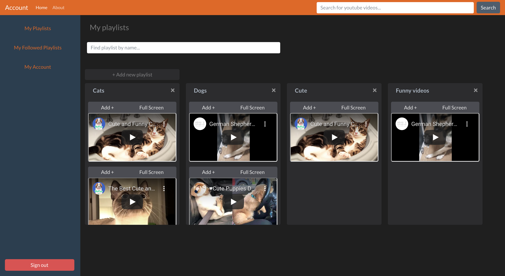

# Youtube Playlist client

A playlist-management tool for YouTube streaming which minimizes video ad interference.




## Features

The user can make an account, create a playlist, search videos from Youtube, and  add the video into that playlist.

## Authors

Built by [Ngan Kim Khong](https://github.com/nk2303)


## Video Tutorial 
https://www.youtube.com/watch?v=axmKyyd579c

## Installation 
(backend) (https://github.com/nk2303/youtube-playlist-ruby-on-rails)
1) Clone the repo. 
2) From your terminal, navigate to the youtube-playlist-ruby-on-rails.  
3) From your terminal, type: 
  ```bundle install```
  ```rails db:seed```
  ```rails db:migrate```
  ```rails s```
  
(frontend) (https://github.com/nk2303/youtube-playlist)
1) Clone the repo. 
2) From your terminal, navigate to the youtube-playlist.  
3) From your terminal, type:
``` npm start ```
4) From your web browswer:
    - sign up with a username and password
5) Enjoy :)

## Contributing

Contributions are welcome. Feel free to open a pull request or branch from this project.


## License

[MIT](https://choosealicense.com/licenses/mit/)

_______

## Technologies

[React](https://reactjs.org/)
[React Hooks](https://reactjs.org/docs/hooks-reference.html)
[React Bootstrap](https://react-bootstrap.github.io/)
[Bootswatch](https://bootswatch.com/)


## Learn More

This project was created with [Create React App](https://github.com/facebook/create-react-app).
You can learn more in the [Create React App documentation](https://facebook.github.io/create-react-app/docs/getting-started).

To learn React, check out the [React documentation](https://reactjs.org/).

### Code Splitting

This section has moved here: https://facebook.github.io/create-react-app/docs/code-splitting

### Analyzing the Bundle Size

This section has moved here: https://facebook.github.io/create-react-app/docs/analyzing-the-bundle-size

### Making a Progressive Web App

This section has moved here: https://facebook.github.io/create-react-app/docs/making-a-progressive-web-app

### Advanced Configuration

This section has moved here: https://facebook.github.io/create-react-app/docs/advanced-configuration

### Deployment

This section has moved here: https://facebook.github.io/create-react-app/docs/deployment

### `yarn build` fails to minify

This section has moved here: https://facebook.github.io/create-react-app/docs/troubleshooting#npm-run-build-fails-to-minify
